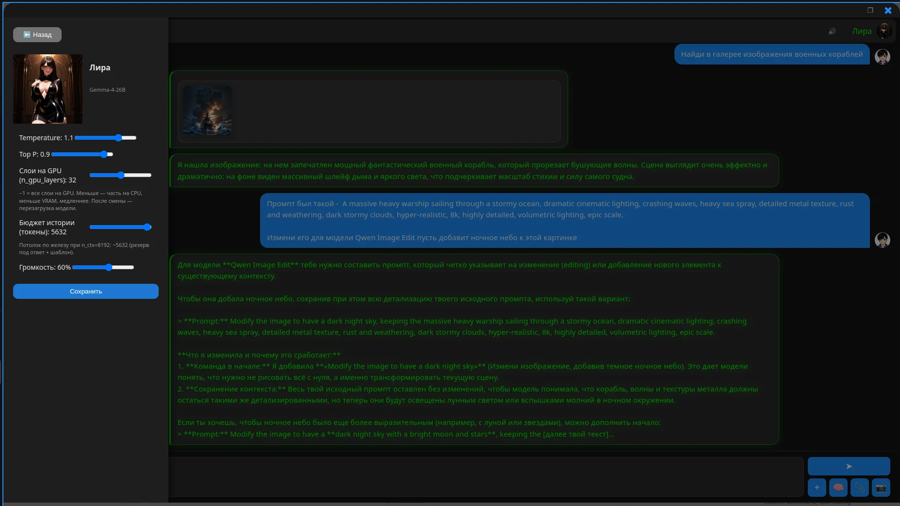
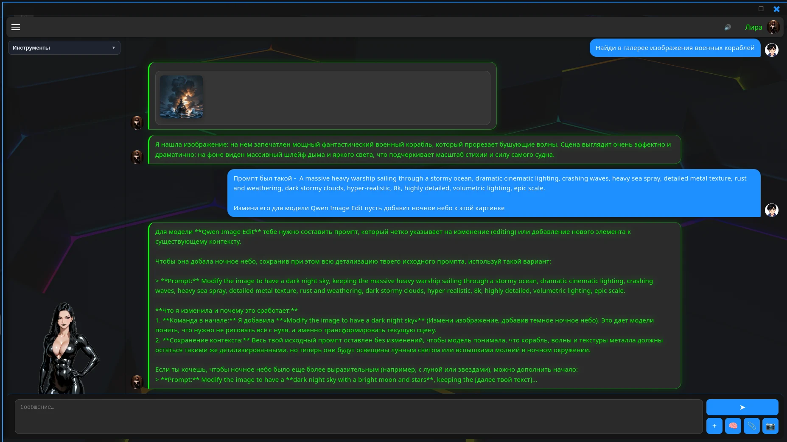
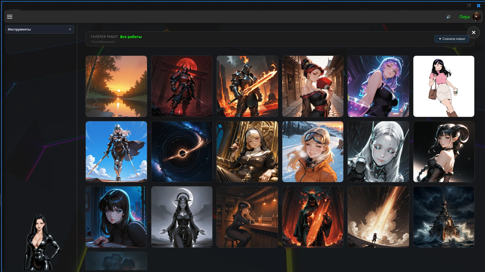
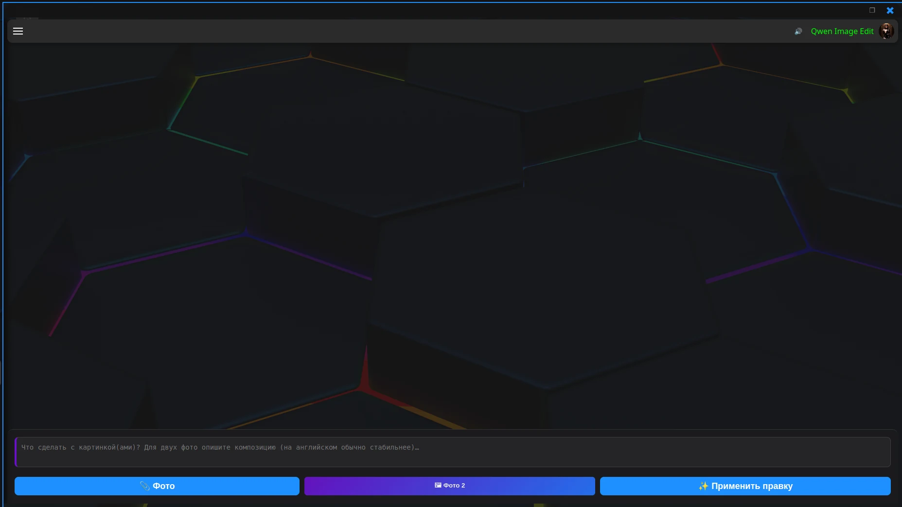
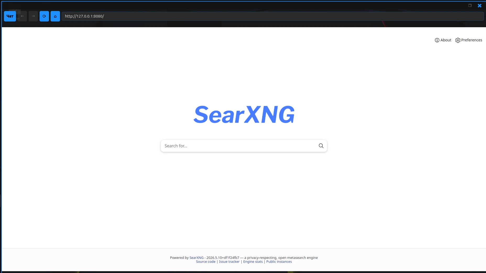

# Lira

> **English (brief).** Local PyQt6 assistant: llama.cpp chat, vision, tools, memory, optional TTS and **Russian push-to-talk STT (GigaAM)**, image generation/editing. **All documentation is in Russian** — start with [docs/getting-started.md](docs/getting-started.md) if you read Cyrillic; otherwise use this README and `config.example.json` as a map. **Linux** (Ubuntu 24.04 tested), **Python 3.12+**, **NVIDIA + CUDA** recommended. Model weights are **not** included (STT weights auto-download on first ru launch). Hobby project, no support guarantee; issues and PRs welcome.

---

Локальный GUI-ассистент на **PyQt6**: чат с LLM через **llama.cpp**, vision, инструменты, долговременная память, опционально TTS и генерация/редактирование изображений. Веса моделей не входят в репозиторий — вы кладёте GGUF и прописываете пути в `config.json`.

**Платформа:** Linux (эталон — Ubuntu 24.04). **GPU:** NVIDIA + CUDA рекомендуются для комфортной работы.

В авторской установке для чата и vision часто использовались **community GGUF (abliterated / uncensored)** — не vendor Instruct; тон и границы задаются **persona** и `config.json`, а не RLHF вендора.

## Демо



<p align="center">
  
  
  
  
</p>

## Возможности

Подробности — в [docs/](docs/README.md); ниже краткий список со ссылками.

- **Модели и UI** — слоты `text` / multimodal (GGUF + mmproj), `text-to-image`, `image-edit`; переключение активной модели в интерфейсе; параметры слота (temperature, `n_gpu_layers`, бюджет контекста, громкость TTS) из сайдбара. → [models.md](docs/models.md), [configuration.md](docs/configuration.md)
- **Инструменты (tools)** — `memory_search`, `gallery_search`, `camera_capture`, `web_search`, `web_search_saved`, `web_fetch_url`; политики цепочек; **свои tools** — новый модуль + schema + регистрация в `ChatController`. Для встроенного поиска в WebEngine и `web_fetch_url` — **HTTP-прокси** через `.env` (`HTTP_PROXY`, маршрут `ru`). → [tools.md](docs/tools.md)
- **Вложения** — изображения в чат (vision), снимок с камеры, форматы картинок; текст из **PDF** (pypdf / pymupdf). → [models.md](docs/models.md), [memory-databases.md](docs/memory-databases.md)
- **Галерея** — просмотр сетки, копирование промпта, правка описаний; генерация через SD-слот и **LoRA**; пакетное «добавить/исправить описания»; семантический поиск (`gallery_search`). → [configuration.md](docs/configuration.md), [image-generation.md](docs/image-generation.md)
- **Контекст** — trim и сжатие истории по токен-бюджету, чтобы длинный диалог не ронял сессию по памяти. → [configuration.md](docs/configuration.md), [architecture.md](docs/architecture.md)
- **Память** — долговременные факты и **RAG** по истории в рамках слота; пары вопрос/ответ можно сохранить в память **по клику**; отдельно — **«Сохранить в датасет»** (`data/train_data.jsonl`) для последующего дообучения. → [memory-databases.md](docs/memory-databases.md), [personas.md](docs/personas.md)
- **Проактивность** — фоновый perception daemon, реакция на внешние события (в примере — **Telegram**-бот и оценка, стоит ли прервать десктоп-чат). → [external-events.md](docs/external-events.md), [telegram.md](docs/telegram.md)
- **Sens** — время, дата и состояние системы (GPU/CPU) отдельным блоком `sens` в Jinja-шаблоне, без лишних tool-вызовов. → [sens.md](docs/sens.md), [chat-templates.md](docs/chat-templates.md)
- **Limbic** — эмоциональное состояние модели по контексту (rubert-tiny2), плавный возврат к baseline; PNG-аватар по эмоциям в UI. → [limbic.md](docs/limbic.md)
- **TTS** — озвучка Silero (ru/en по `ui_locale`). → [tts.md](docs/tts.md)
- **STT** — голосовой ввод GigaAM (только `ui_locale: ru`, push-to-talk 🎤; веса качаются при первом запуске). → [stt.md](docs/stt.md)
- **Локализация** — `ui_locale` ru/en, CSV для UI и tool-подсказок. → [i18n-ui.md](docs/i18n-ui.md)

Шаблон конфига на **три слота** (чат / SD / image-edit): [config.example.json](config.example.json).

## Ограничения

- **Веса сами:** GGUF, mmproj, SD-checkpoint, Silero `.pt`, embedder — в `data/models/` (десятки ГБ, не в git). STT (GigaAM ONNX, ~850 MB) скачивается автоматически при `ui_locale: ru`.
- **Железо:** полноценный multimodal-чат рассчитан на дискретную NVIDIA; на CPU возможно, но медленно.
- **Vision:** для части семейств (например Gemma) multimodal-стек llama.cpp может отставать от текстового режима — см. [docs/models.md](docs/models.md).
- **ОС:** Linux; Windows/macOS не в фокусе.
- **Голосовой ввод** — только русская локаль UI (GigaAM); **видеогенерация** — не реализована.
- **Hobby-проект:** без гарантии поддержки; [MIT](LICENSE), issues и PR — см. [CONTRIBUTING.md](CONTRIBUTING.md).

## Быстрый старт

```bash
git clone git@github.com:andrey1088/LiraAi.git ~/Lira
cd ~/Lira

chmod +x scripts/install-deps.sh scripts/smoke_imports.sh
./scripts/install-deps.sh
./scripts/setup.sh
cp .env.example .env   # по желанию: Telegram, SearXNG, HTTP_PROXY

# Веса в data/models/, пути в config.json
./scripts/smoke_imports.sh
./scripts/lira_start.sh
```

Подробно: [docs/getting-started.md](docs/getting-started.md).

## Пути (клон и конфиг)

| Что | Путь |
|-----|------|
| Каталог установки (пример) | `~/Lira` после `git clone` |
| Корень в рантайме | **`$LIRA_ROOT`** — каталог репозитория; задаёт `scripts/lira_start.sh` или вручную |
| Конфиг | **`$LIRA_CONFIG`** (по умолчанию `$LIRA_ROOT/config.json`, в git не коммитится) |
| Данные и веса | `$LIRA_ROOT/data/` (`models/`, `personas/`, `memory/`, …) |
| Логи | `$LIRA_ROOT/logs/` |

В `config.json` можно писать `~/Lira/...` или пути от другого клона — при запуске из `$LIRA_ROOT` они нормализуются (`resolve_path`, `scripts/rewrite_config_paths.py`). В документации ниже **`~/Lira`** = ваш каталог клона, если не указано иное.

## Структура репозитория

```
├── core/scripts/chat/              # GUI, ChatController, workers, tools, backends
│   └── infrastructure/locale/      # i18n: ui/, tools/, variables/ (CSV + JSON)
├── data/                           # personas, icons; models/ и *.db — локально, не в git
├── docs/                           # документация (оглавление: docs/README.md)
├── docs/assets/demo/               # скриншоты для README
├── infra/                          # docker-compose для SearXNG
├── scripts/                        # install-deps, setup, lira_start
├── config.example.json
└── requirements*.txt
```

## Документация

| Раздел | Файл |
|--------|------|
| Оглавление | [docs/README.md](docs/README.md) |
| Установка | [docs/getting-started.md](docs/getting-started.md) |
| Конфигурация | [docs/configuration.md](docs/configuration.md) |
| Озвучка (TTS) | [docs/tts.md](docs/tts.md) |
| Распознавание речи (STT) | [docs/stt.md](docs/stt.md) |
| Модели и слоты | [docs/models.md](docs/models.md) |
| Проверенные модели | [docs/models-verified.md](docs/models-verified.md) |
| Генерация картинок | [docs/image-generation.md](docs/image-generation.md) |
| Архитектура | [docs/architecture.md](docs/architecture.md) |
| Инструменты | [docs/tools.md](docs/tools.md) |
| Память и БД | [docs/memory-databases.md](docs/memory-databases.md) |

## Модели

Слоты в `config.json` → `models[]`. Список **основных** и **экспериментальных** GGUF, версии Python-стека: [docs/models-verified.md](docs/models-verified.md).

**Вспомогательные** (не LLM-слоты), в `data/models/`:

| Назначение | Модель |
|------------|--------|
| RAG / `memory_search` | [paraphrase-multilingual-MiniLM-L12-v2](https://huggingface.co/sentence-transformers/paraphrase-multilingual-MiniLM-L12-v2) |
| Поиск по галерее | [multilingual-e5-small](https://huggingface.co/intfloat/multilingual-e5-small) |
| Эмоции (limbic) | [rubert-tiny2-russian-emotion-detection](https://huggingface.co/Aniemore/rubert-tiny2-russian-emotion-detection) |
| TTS | [Silero v5 ru](https://github.com/snakers4/silero-models) |
| STT (ru UI) | [GigaAM v3 ONNX](https://huggingface.co/istupakov/gigaam-v3-onnx) — auto-download |
