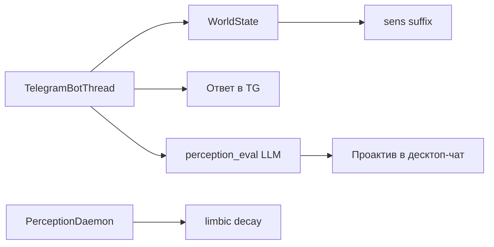

# Внешние события и проактив

Контур **perception**: Lira реагирует на события **вне обычного окна чата** (Telegram, таймеры, «мир»), не смешивая их с перепиской владельца в UI.

Код: `infrastructure/external_events/`, `infrastructure/lifecycle/perception_daemon.py`, `infrastructure/lifecycle/perception_eval.py`.

Подробнее про бота: [telegram.md](telegram.md).

## Основные понятия

| Понятие | Описание |
|---------|----------|
| `PerceptionEvent` | Нормализованное событие: `key`, `value`, `source`, `priority`, `ts` |
| `WorldState` | Агрегат «что сейчас в мире» (последнее TG-сообщение и т.д.) — кусок может попасть в **sens** |
| `PerceptionRuleEngine` | Правила из `config.perception_rules.json` → проактивные задачи |
| `PerceptionDaemon` | Qt-таймеры: Telegram-поток, eval, limbic decay, проактив в чат |

## Жизненный цикл (упрощённо)



1. **Событие** (например сообщение в Telegram) → `PerceptionEvent`.
2. **Ответ в канале** — отдельный LLM-вызов с system из persona `telegram_bot_reply` (нейтральный тон, **без** tools галереи/памяти/web).
3. **Оценка** — `perception_eval_system` + tool `telegram_life_eval`: нужно ли **уведомить владельца** в основном чате (`should_notify_andrey`).
4. Если да — **проактив**: короткая реплика в UI (`build_proactive_context` без полной истории чата).
5. Параллельно daemon обновляет **limbic** (затухание) и дописывает в sens «прошло N времени» при неактивности.

## Отделение от основного чата

- Реплики канала Telegram **не сохраняются** в `chat_messages` как обычный user (фильтр `is_telegram_channel_user_content`).
- В **контекст** основного чата TG-строки не подмешиваются (`ContextManager.build_context`).
- Владелец в TG-промптах — `{user_name}` / «владелец», не «собеседник в боте».

## Telegram (пример)

| Этап | Что происходит |
|------|----------------|
| Вход | `TelegramBotThread`, конфиг через `telegram_config` / `.env` |
| Контекст для модели | `telegram_external_context_block()` — «это бот, не десктоп» |
| System prompt | `telegram_bot_reply` в [personas.md](personas.md) |
| Уведомление владельца | `telegram_life_eval` → проактив в Lira |

Имя tool `should_notify_andrey` — историческое; в описании tool — «владелец».

## Включение

У слота модели в config:

```json
"perception_daemon": true,
"limbic_images_path": "~/Lira2/data/models/…/limbic"
```

Без limbic-каталога daemon для модели **не** активируется (`model_perception_daemon_enabled`).

Глобальные правила: `config.perception_rules.json` (пороги, тексты проактивов).

## Активность пользователя

`activity_gate` — не будить проактивом, пока пользователь печатает или недавно писал в чат (см. комментарии в `activity_gate.py`).

## Конфигурация и секреты

- Токен бота — **не** в git (`.env`, см. будущий `.env.example`).
- `config.perception_rules.json` — без личных токенов.

## Связанные документы

- [sens.md](sens.md) — как события дополняют sens  
- [limbic.md](limbic.md) — decay и эмоции  
- [tools.md](tools.md) — `telegram_life_eval`  
- [memory-databases.md](memory-databases.md) — что не пишется в UI-БД  
